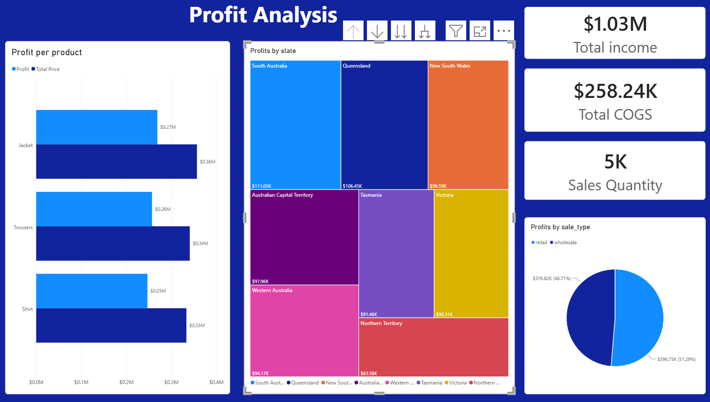

# Noom-Noom Fashion – Power BI practice

My solutions to the Power BI class practice from the Data Analyst program
at NewTech Academy (2026). The exercises follow one fictional clothing
retailer, Noom-Noom Fashion, from raw exports to a finished report: each
lesson builds on the file from the previous one.



## Lessons

| # | Topic | What I practised | Notes |
|---|-------|------------------|-------|
| 1 | Data preparation | Import, clean and combine order exports; profile data quality | [Lesson 1](docs/lesson-01-data-preparation/README.md) |
| 2 | Advanced preparation | Unpivot, split columns, merges on two keys, calculated columns | [Lesson 2](docs/lesson-02-advanced-preparation/README.md) |
| 3 | Data modeling | Relationships, column formats, calculated columns and DAX measures | [Lesson 3](docs/lesson-03-data-modeling/README.md) |
| 4 | Data visualization | Report pages, hierarchies, drill down, interactions between visuals | [Lesson 4](docs/lesson-04-data-visualization/README.md) |
| 5 | Filtering and design | Slicers, sync slicers, filters pane, Top N | _In progress_ |

## Key results

- 1,010 orders, 5,000 sales lines, 1,000 customers and 1,260 products,
  cleaned and connected in one model.
- Total revenue $1.03M, cost of goods $258K, profit $774K.
- Jacket is the most profitable product type; South Australia is the
  most profitable state; retail and wholesale bring about half of the
  profit each.

## Repository structure

```
noom-noom-fashion-powerbi/
├── README.md
├── docs/
│   ├── lesson-01-data-preparation/      README.md, lesson-01.pbix
│   ├── lesson-02-advanced-preparation/  README.md, lesson-02.pbix
│   ├── lesson-03-data-modeling/         README.md, lesson-03.pbix
│   ├── lesson-04-data-visualization/    README.md, lesson-04.pbix
│   └── lesson-05-filtering-and-design/  (in progress)
└── images/
    ├── lesson-01/  …  lesson-05/        screenshots used in each README
```

## How to open the files

1. Install Power BI Desktop (free, Windows).
2. Download or clone this repository.
3. Open the .pbix file in a lesson folder. The data is saved inside the
   file, so the report opens as it is.

The source files (CSV and Excel exports) are course material from
NewTech Academy and are not included, so a data refresh will not work
outside my computer.

## Tools

Power BI Desktop · Power Query (M) · DAX

## About me

Senior NDT inspector with 14 years in industrial quality control, now
building my skills as a data analyst.
[LinkedIn](https://www.linkedin.com/in/angel-iana)
