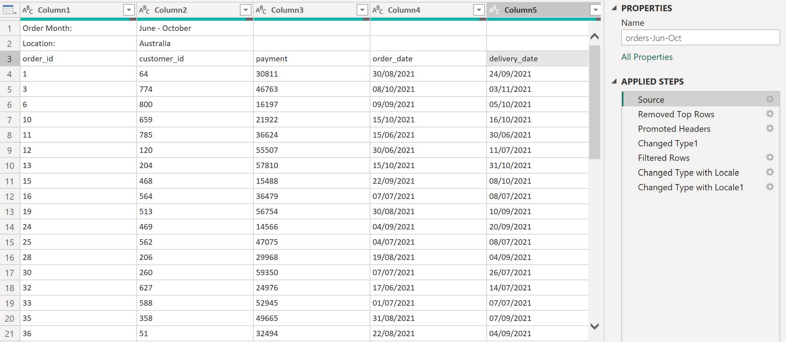
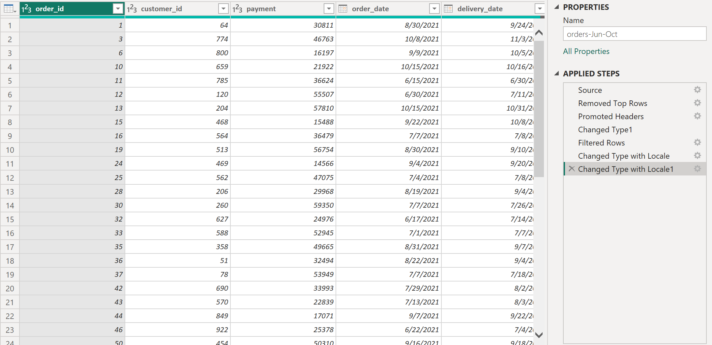
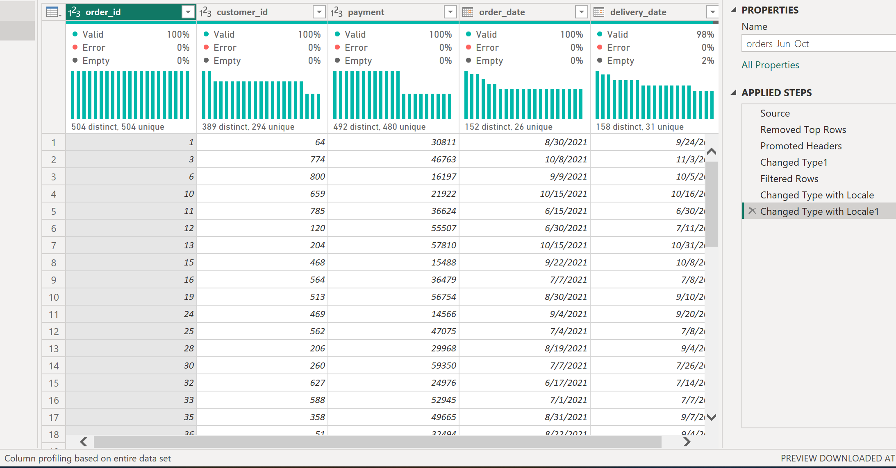
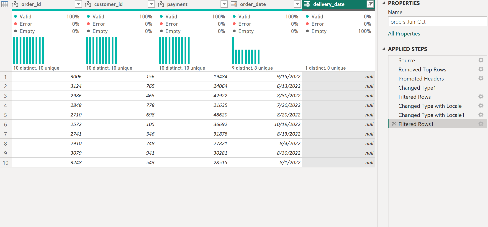
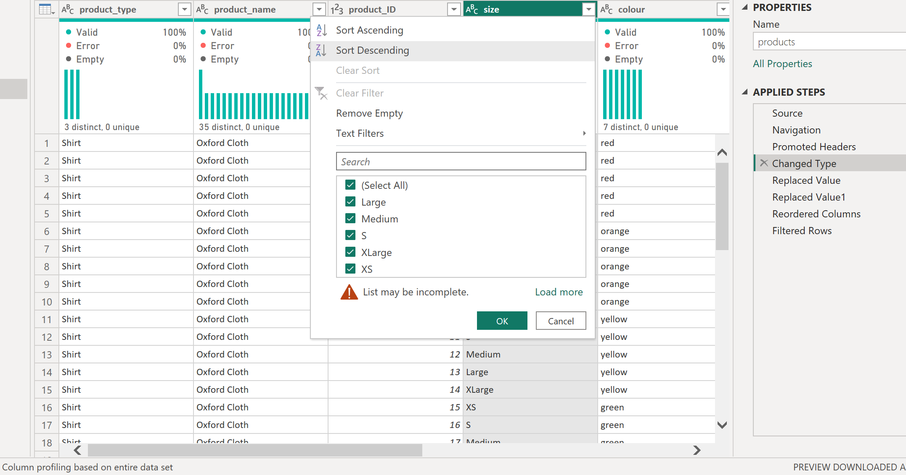
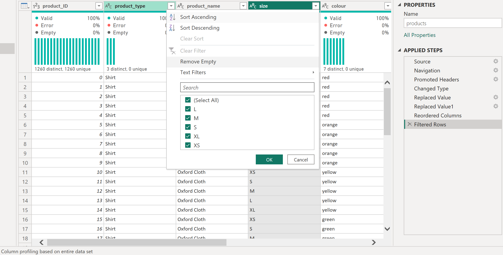
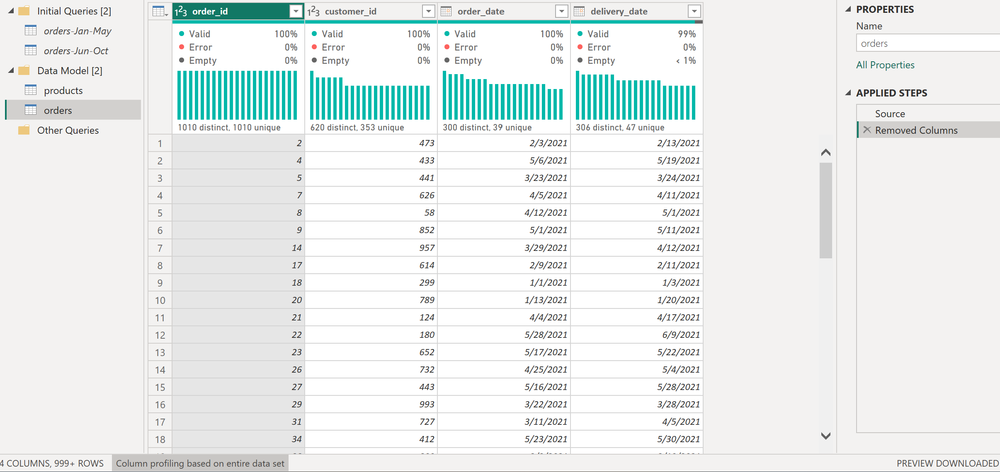

# Lesson 1 – Data preparation

First step of the Noom-Noom Fashion project, a fictional clothing retailer:
importing the two 2021 order exports and getting them ready for analysis
in Power Query, plus the product catalogue.

## What I did

- Imported the two order files (Jan–May and Jun–Oct) and removed the two
  description lines above the header.
- Removed blank rows and set column types; converted order and delivery
  dates from day-first text (dd/mm/yyyy) to Date using a day-first locale.
- Profiled every column on the full data set before deciding what to keep.
- Imported the product catalogue (1,260 products, 8 columns) from Excel;
  no column has missing values and every product_ID is unique. Moved
  product_ID to the first column.
- Standardised sizes: the source mixed letters (XS, S) and words
  (Medium, Large, XLarge). All sizes now use XS, S, M, L, XL
  (252 products each).
- Appended the two order queries into one orders table (1,010 orders) and
  removed the payment column, which is not needed for the analysis.
- Organised the queries in groups and disabled loading for the two
  source queries, so the data model contains only orders and products.

## Decisions I made about the data

- **Removed 4 orders without an order ID** (Jun–Oct). They had no customer
  either, only a payment amount, so they cannot be linked to anything.
- **Kept 10 orders without a delivery date** (2% of Jun–Oct). They look
  like orders not delivered yet. All 10 have order dates in 2022, outside
  the 2021 period of the export – something I would check with the data
  owner.

Result: 506 orders (Jan–May) and 504 orders (Jun–Oct), 1,010 in total.
Every order ID is unique across both files (1,010 distinct, 1,010 unique).

## What I learned

- Column profiling uses only the first 1,000 rows by default; I switched
  it to the entire data set before reading the quality bars.
- A filter used only to inspect rows can be deleted from Applied Steps
  without losing the rest of the work.
- Intermediate queries should not be loaded: with load enabled, Power BI
  also auto-created relationships between them and the combined table.
- Dates stored as dd/mm/yyyy text need the right locale, otherwise day
  and month are swapped.
- Replace Values matches text inside a cell by default: replacing
  "Large" with "L" also turned "XLarge" into "XL". Useful here, but
  for codes or names I would tick "Match entire cell contents".

Steps in Power Query

| Query | Steps |
|-------|-------|
| orders-Jan-May | Import CSV › Remove top 2 rows › Use first row as headers › Change types › Remove blank rows › Dates to Date (locale ro-RO, day first) |
| orders-Jun-Oct | Import CSV › Remove top 2 rows › Use first row as headers › Change types › Keep rows with an order_id › Dates to Date (locale ro-RO) |
| orders | Append orders-Jan-May + orders-Jun-Oct (as new) › Remove payment |
| products | Import Excel › Use first row as headers › Change types › Replace "Medium" → M, "Large" → L (XLarge → XL follows) › product_ID first |

## Screenshots

**Raw export vs. cleaned query**

**Column quality on the full data set**

**Orders without a delivery date**

**Product sizes before and after standardisation**

**Combined orders table**

