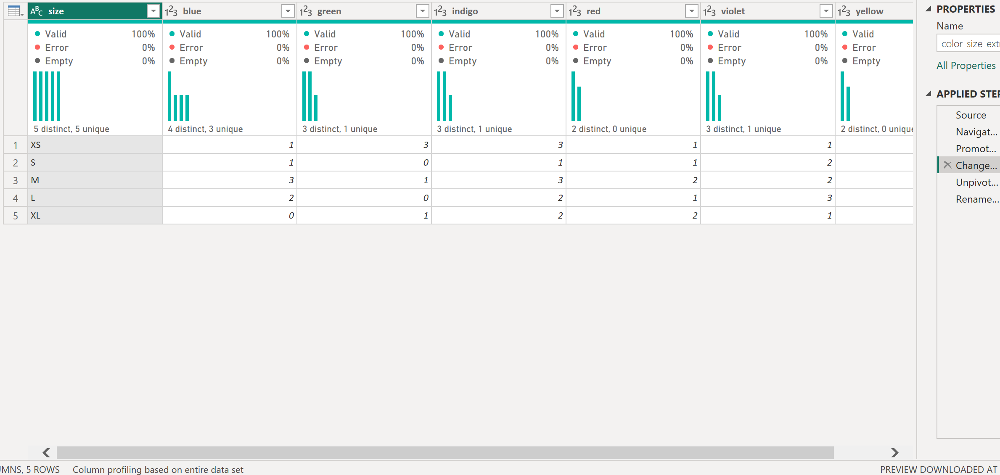
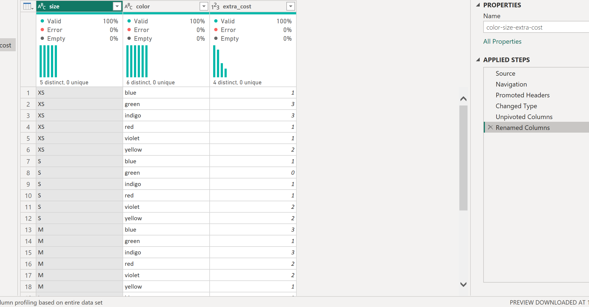
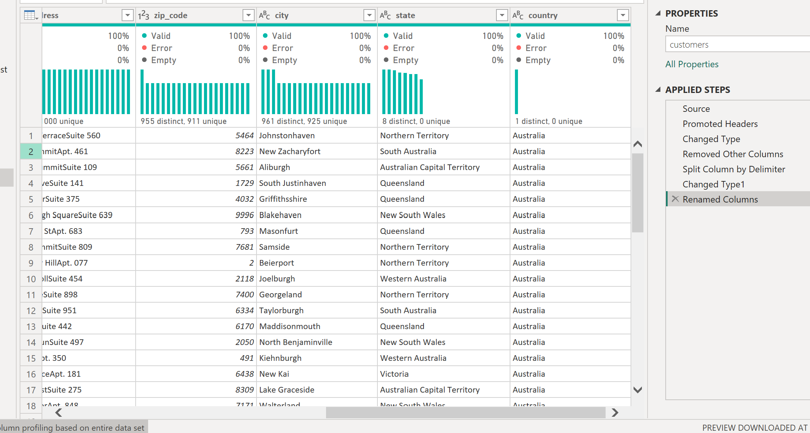
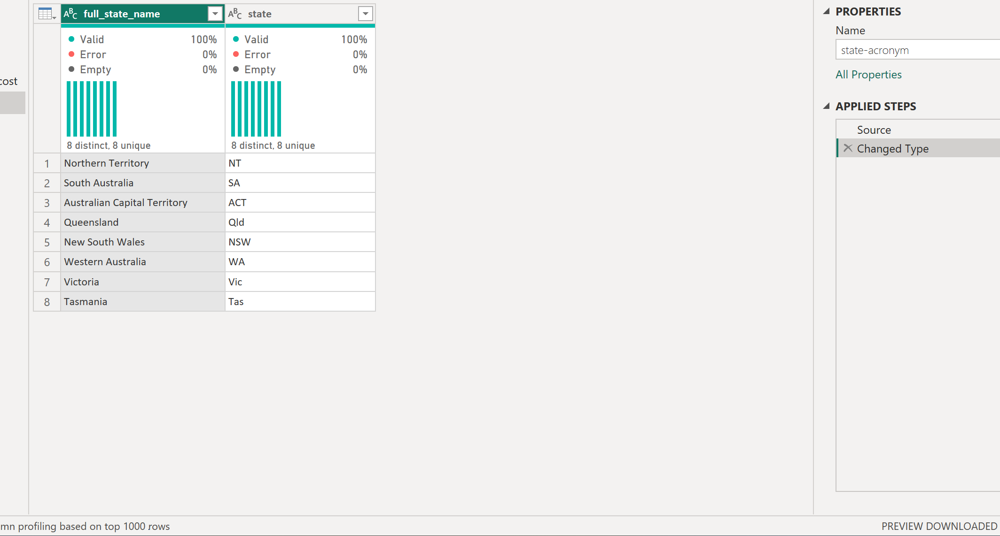
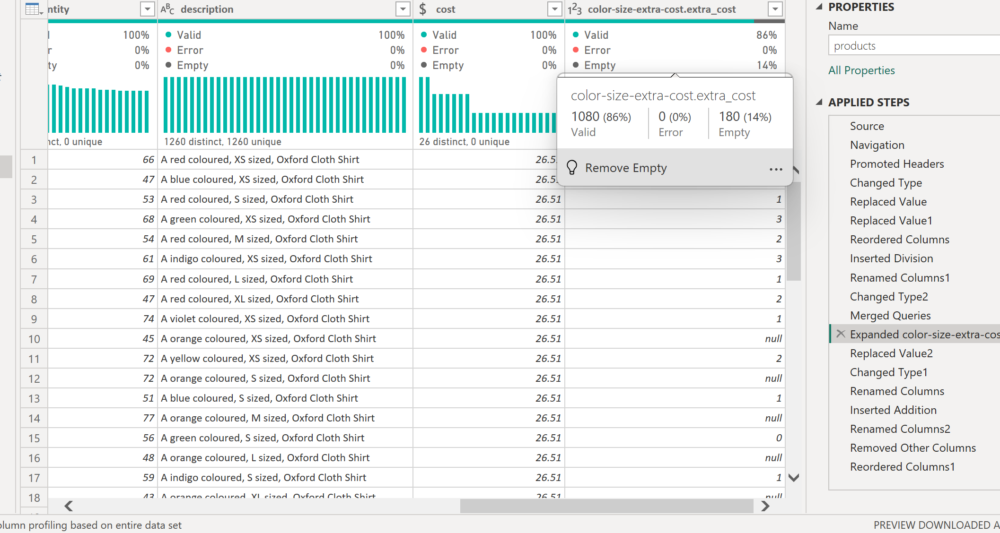
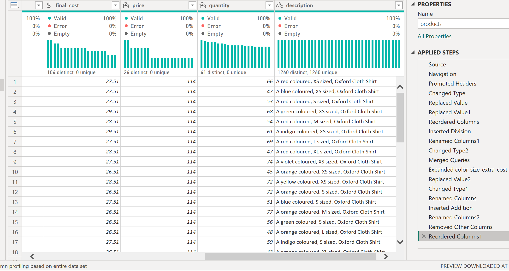
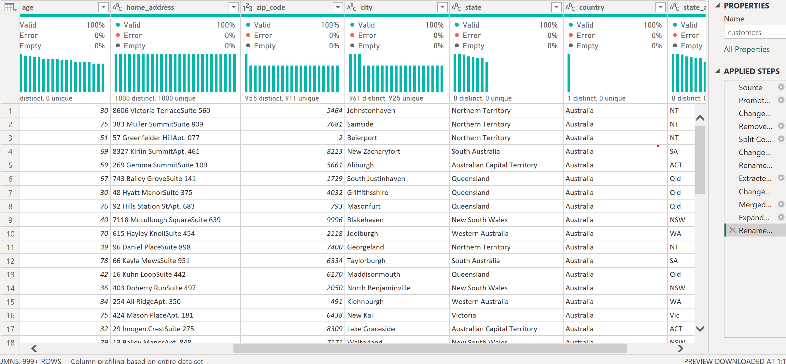
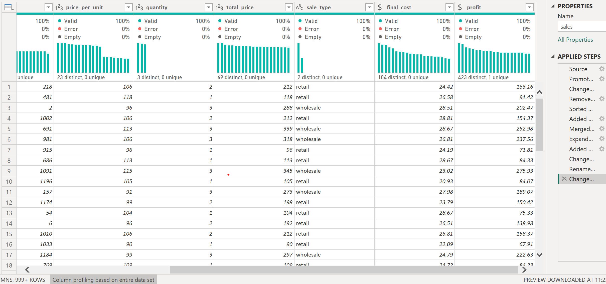
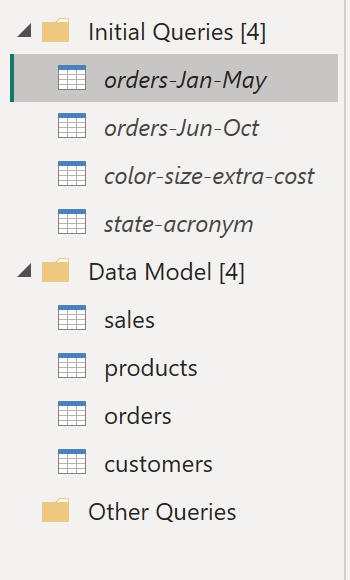

# Lesson 2 – Advanced preparation

Second step of the Noom-Noom Fashion project: bringing in the sales,
customers and extra-cost data and reshaping it so it can be combined
with the orders and products from Lesson 1.

## What I did

**Part 1 – Pivot, unpivot, extract and sort**

- Turned the colour/size extra-cost matrix (sizes in rows, one column per
  colour) into a flat table with Unpivot Other Columns: size, color,
  extra_cost – 30 rows (5 sizes × 6 colours).
- Imported 5,000 sales lines, hid the line_number column and sorted by
  sales_id.
- Imported 1,000 customers and hid the personal ID number and the
  update date, which are not needed for the analysis.
- Split the combined "State, Country" column into state and country.
- Built a small lookup table with the 8 Australian states and their
  abbreviations (NSW, Vic, Qld …), to be joined to customers later.

**Part 2 – Calculated columns and connecting tables**

- Calculated each product's cost from its list price (price ÷ 4.3, the
  company's profit multiplier).
- Joined the extra-cost table to products on two columns at once, size
  and colour. 1,080 of 1,260 products matched; the 180 orange products
  have no extra cost in the source, so their missing values became 0.
  The join only works because the sizes were standardised in Lesson 1.
- Added final_cost = cost + extra_cost, kept only final_cost visible and
  placed it next to price.
- Customers: kept only the number from "30 years old" (ages 20–80),
  and added the state abbreviation from the lookup table – all 1,000
  customers matched.
- Sales: labelled each line as retail (1–2 items) or wholesale (3+),
  brought in final_cost from products and calculated
  profit = total_price − final_cost × quantity.
- Only the four tables used for analysis (orders, customers, sales,
  products) are loaded; the source and lookup queries are not.

## Screenshots

**Extra-cost matrix before and after unpivot**

**State and country after the split**

**State abbreviations lookup**

**Extra cost joined to products – 1,080 matched, 180 orange products without a match**

**Products with final_cost next to price**

**Customers: numeric age and state abbreviation**

**Sales: sale type, final cost and profit per line**

**Queries pane: source queries not loaded, four tables in the model**

## What I learned

- Unpivot Other Columns keeps the selected column and turns every other
  column into rows, so a new colour added to the source would still be
  picked up.
- Choose Columns hides columns without deleting them from the source.
- A merge can match on several columns, but they must be selected in the
  same order in both tables; the merge window shows how many rows match
  before you confirm.
- Missing matches come back as null, so a left join needs a decision
  about what null means – here, no extra cost.

Steps in Power Query

| Query | Steps |
|-------|-------|
| color-size extra cost | Import Excel › Use first row as headers › Change types › Unpivot other columns › Rename to color, extra_cost |
| sales | Import CSV › Use first row as headers › Change types › Choose columns (without line_number) › Sort by sales_id |
| customers | Import CSV › Use first row as headers › Change types › Choose columns (without id_number, modify_date) › Split state_country › Rename to state, country |
| State acronym | Enter Data: full_state_name, state (8 rows) |
| products | … › cost = price / 4.3 › Merge with extra cost on size + colour › null → 0 › final_cost = cost + extra_cost › Choose columns |
| customers | … › Age: text before " " › Whole number › Merge with State acronym › Rename to state_acronym |
| sales | … › Conditional column sale_type › Merge with products (final_cost) › Custom column profit |

