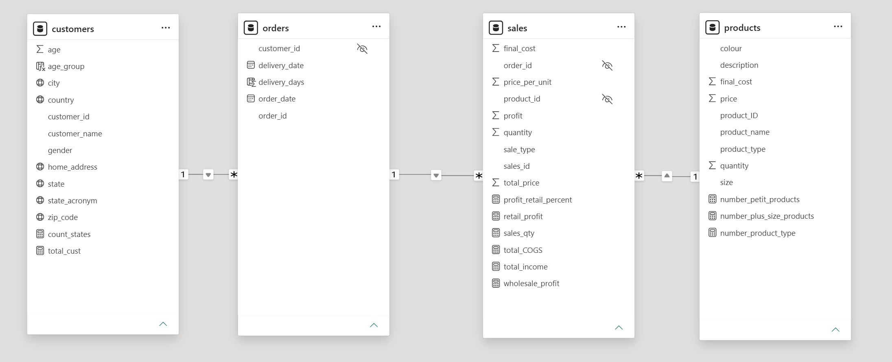
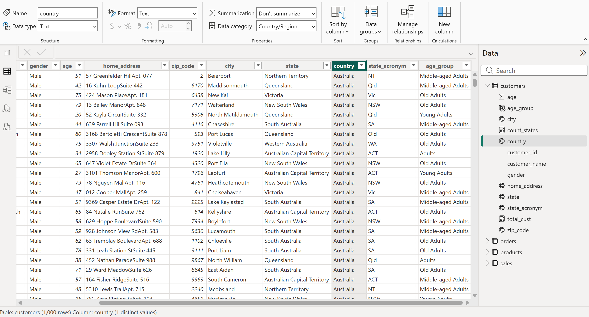
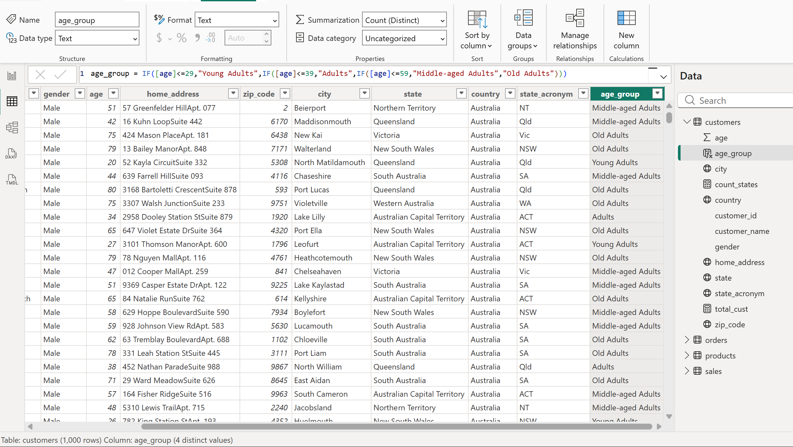
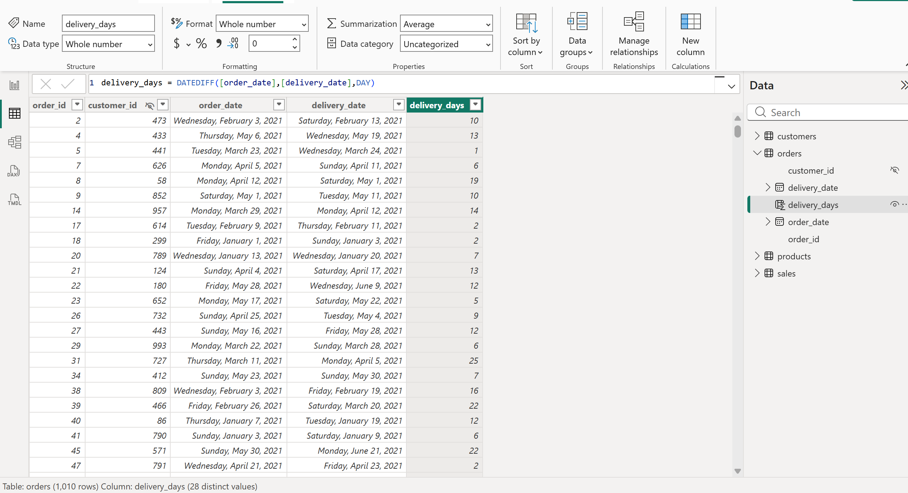
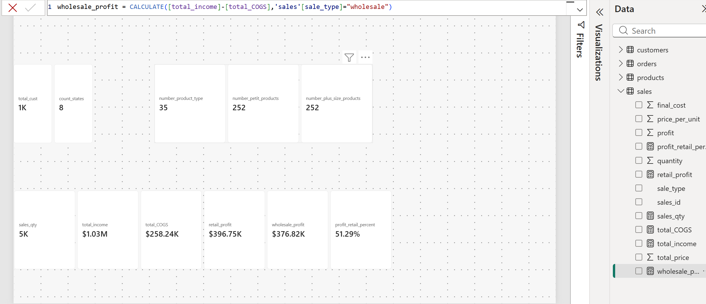

# Lesson 3 – Data modeling

Third step of the Noom-Noom Fashion project: connecting the four tables
into one model, setting column types and formats, and adding the first
calculated columns and measures in DAX.

## What I did

**Part 1 – Model view and data view**

- Removed the relationships Power BI had created automatically and built
  them again myself, from the "one" side to the "many" side:
  customers → orders, orders → sales, products → sales (one-to-many,
  single direction).
- Hid the three foreign keys (customer_id in orders, order_id and
  product_id in sales), so report users pick these fields from the
  dimension tables instead.
- Set data types, currency formats and data categories (address, postal
  code, city, state, country) so map visuals can recognise the location
  fields.

**Part 2 – Calculated columns and measures**

- age_group (customers): Young Adults (≤ 29), Adults (30–39),
  Middle-aged Adults (40–59), Old Adults (60+).
- delivery_days (orders): days between order and delivery – 1 to 27
  days, average 14; blank for the 10 orders not delivered yet.
- Measures:

| Measure | Result |
|---------|--------|
| total_cust | 1,000 customers |
| count_states | 8 states |
| number_product_type | 35 product names |
| number_petit_products / number_plus_size_products | 252 XS / 252 XL items |
| sales_qty | 5,000 sales lines |
| total_income | $1,031,800 |
| total_COGS | $258,237 |
| retail_profit / wholesale_profit | $396,747 / $376,816 |
| profit_retail_percent | 51.29% |

## Screenshots

**Model view – three one-to-many relationships, foreign keys hidden**

**Data category for location fields**

**Calculated columns**

**Measures**

## What I learned

- In this model orders works like a header table for sales: one order has
  many sales lines, so the filter flows from orders to sales.
- A calculated column is stored row by row in the table; a measure is
  calculated on the fly for whatever is selected in the report.
- CALCULATE changes the filter context – here it limits profit to retail
  or wholesale lines. My first version wrapped the measures in SUMX over
  every sales row; it gave the same result, but CALCULATE alone is
  simpler and faster.
- Data category matters for maps: a typo like "County" instead of
  "Country" would make Power BI look for a county called Australia.
