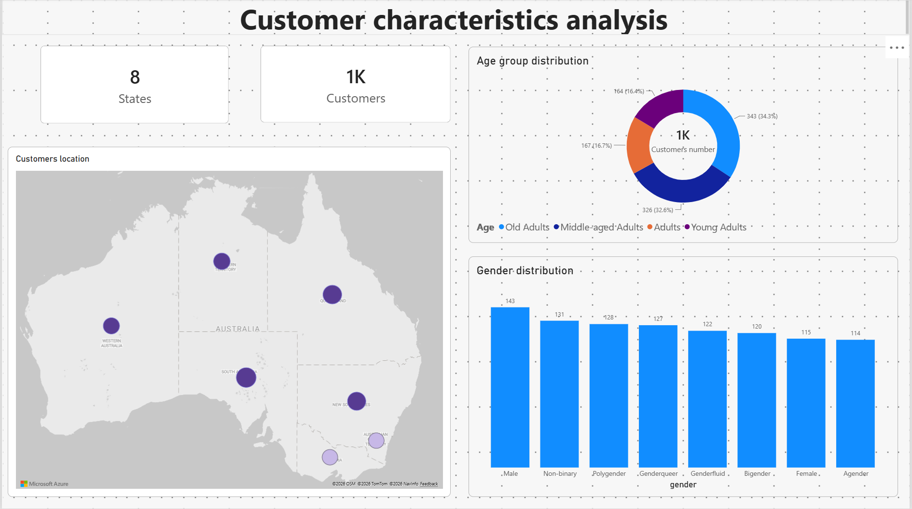
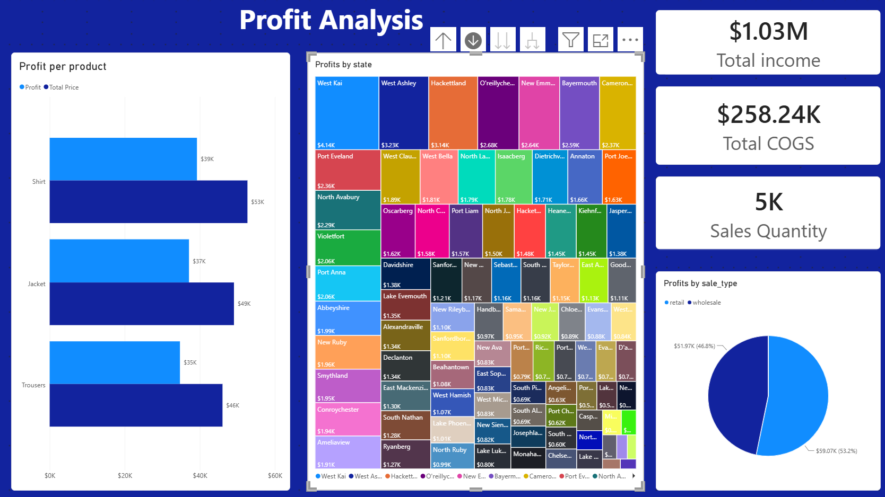
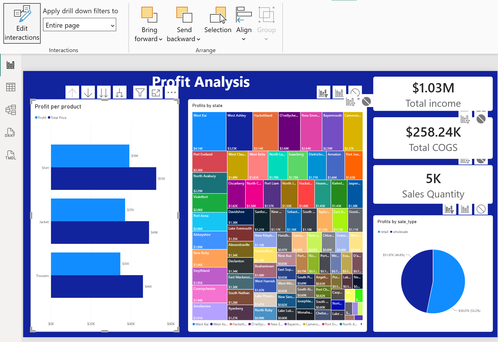

# Lesson 4 – Data visualization

Fourth step of the Noom-Noom Fashion project: two report pages built on
the model from Lesson 3 – one about the customers, one about profit.

## What I did

**Customer analysis**

- Cards with the number of states (8) and customers (1,000).
- Clustered column chart of customers by gender, data labels instead of
  a value axis.
- Donut chart of the four age groups, with a card in the centre showing
  the customer count; clicking a slice updates the number.
- Map with one bubble per state, sized and coloured (light to dark
  purple) by the number of customers. I used the Azure Maps visual,
  which replaces the retired Bing-based Map visual.

**Profitability analysis**

- Two hierarchies: Location (state › city) and Product (product type ›
  product name › product ID).
- Clustered bar chart of profit and revenue by product, with drill down
  through the product hierarchy. Jacket is the most profitable product
  type (about $269K).
- Treemap of profit by state, drillable to city level. South Australia
  brings the most profit ($111K), Northern Territory the least ($84K).
- Pie chart of profit by sale type: retail 51.3%, wholesale 48.7%, with
  revenue in the tooltip.
- Cards for total income ($1.03M), total cost ($258K) and number of
  sales lines (5,000).
- Dark canvas background on this page only (a theme would change every
  page).

**Interactions between visuals**

- The three cards ignore selections in the other visuals, so they always
  show the totals.
- The bar chart, treemap and pie chart filter each other instead of the
  default highlighting.

## Screenshots

**Customer analysis**

**Profitability analysis**

**Drill down into South Australia – the other charts filter to the same state**

**Edit interactions – cards set to None**

## What I learned

- Hierarchies let one chart answer questions at several levels; drill
  down filters the rest of the page to the selected item.
- Edit interactions decides how a selection affects each visual:
  filter, highlight or nothing. KPI cards usually work best with none.
- A report theme applies to all pages; for one page with a different
  look, the canvas background is the right setting.
- Map visuals depend on clear location names – it is worth checking
  that each bubble lands in the right place.
