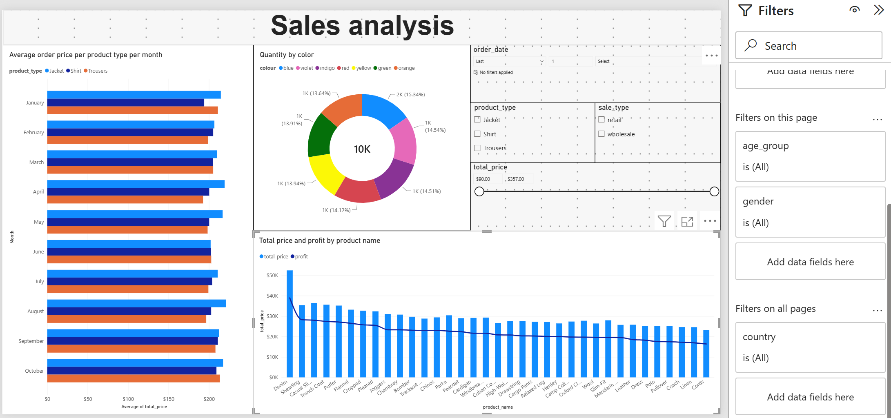
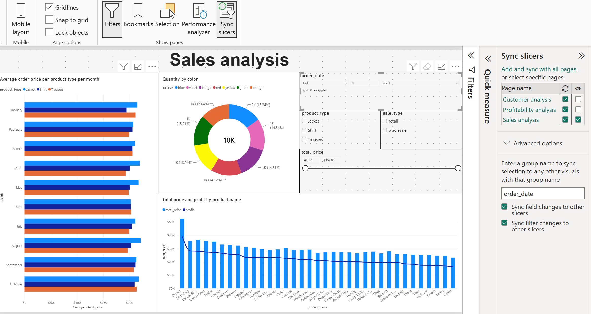
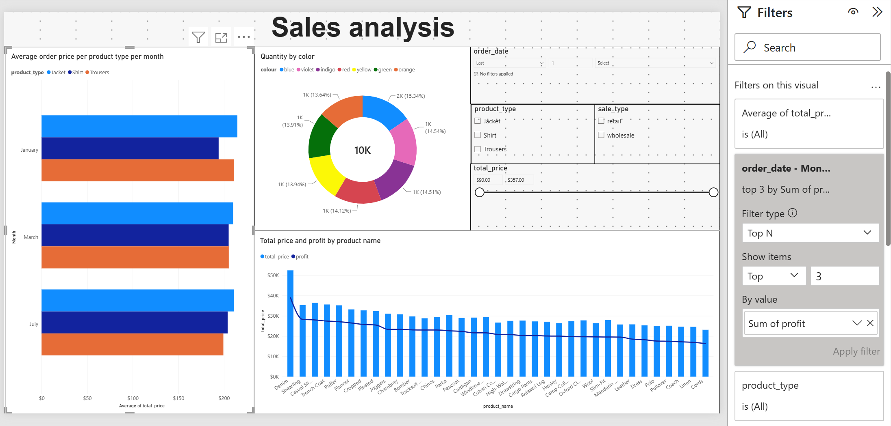

# Lesson 5 – Slicers and filters

Last step of the Noom-Noom Fashion project: a Sales analysis page that the
user can filter with slicers and the filters pane, plus a few questions
answered directly from the report.

## What I did

- **Average order price per product type per month** – clustered bar chart
  with the order month on the axis and product type as the legend.
- **Quantity by colour** – donut chart of items sold (about 10,000) by
  product colour.
- **Total price and profit by product name** – line and clustered column
  chart: revenue as columns, profit as a line, for all 35 product names.
- Four slicers:
  - order date as a relative date slicer (last X days/months/years);
  - product type and sale type as lists;
  - total price as a between slider ($90 – $357).
- Visuals on the page filter each other instead of highlighting.
- **Sync slicers:** order date, product type and sale type filter all
  three report pages but are visible only on this one; the total price
  slicer works only on this page.
- **Filters pane:** age group and gender filter this page, country
  filters every page.

## Questions answered with the report

| Question | Answer | How |
|----------|--------|-----|
| Three months with the highest profit | March, January, July | Top N filter (top 3 by profit) on the month axis |
| Best-selling colour for trousers in retail sales | Indigo (273 items) | Product type and sale type slicers + donut chart |
| Five least profitable products | Cords, Linen, Coach, Pullover, Polo | Combo chart sorted by profit |

## Screenshots

**Sales analysis page with the filters pane**

**Sync slicers – order date filters every page, visible only here**

**Top N filter – the three most profitable months**

## What I learned

- A slicer, a filter in the filters pane and a visual-level filter can all
  do the same job; the choice depends on whether the user should see and
  change it.
- Sync slicers separates two things: where a slicer filters and where it
  is shown.
- A relative date slicer only makes sense with current data – my sales
  are from 2021, so a "last 1 year" setting would leave the page empty.
- Adding a field to the Drill through area turns a page into a drillthrough
  target and adds a Back button; I added one by mistake and removed it.
